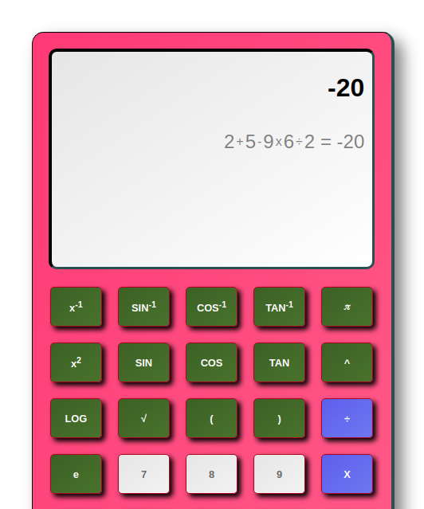

<h2><b>Scientific Calculator</b></h2>

In this calculator, all inputs are tokenized and stored as string elements in an array. Number and decimal inputs that are part of larger number inputs are combined together into the same array element.

When the calculator is asked to solve, it first starts looking in this array for the innermost group of parentheses, solves everything inside this group, and then starts looking for the next innermost group of parentheses. Once it can't find any more, it runs thorugh the array one last time and computes the result.

When solving nested parentheses, it can solve the types, ((a + b) + (a + b) + (a + b)) and (a(a (a + b))), and also their combination: ((a + b) + (a + b) + (a + b)) / (a(a (a + b)))

